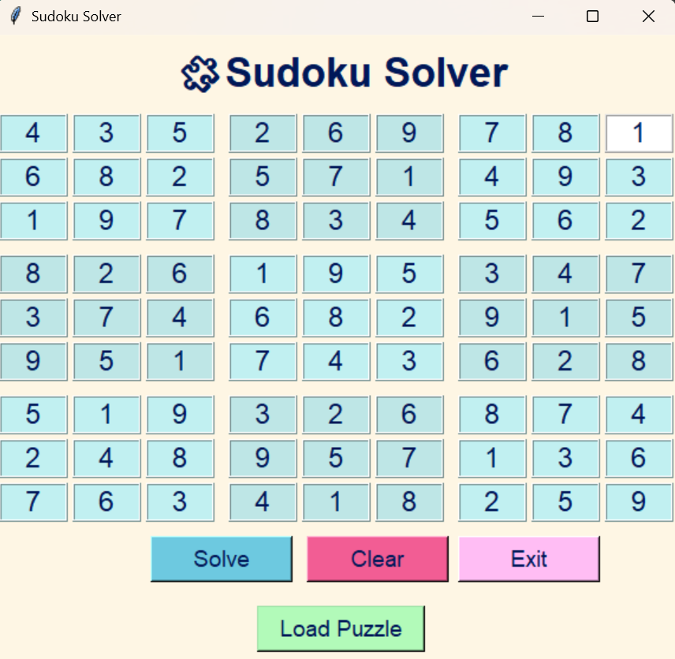

# 🧩 Sudoku Solver - PRODIGY_SD_04

A beautifully animated **Python** **Tkinter** application that solves any valid 9x9 Sudoku puzzle — right in front of your eyes!
Whether you're stuck or just curious, this app lets you watch the solving process step-by-step with a colorful interface and real-time backtracking animation. 
It also changes color while u hover your mouse on it.🎨💡

---  

## 📸 Screenshot



---

## ✨ Features
    -🎯 Solve any valid Sudoku puzzle interactively 
    -🖌️ Beautifully color-coded grid with hover effects
    -🎞️ Animated solving with backtracking visualization
    -💡 Input validation with clean error messages
    -🔄 Load sample puzzle, Clear grid, or Exit anytime
    -🔢 Prevents more than one digit per cell for better UX

---

## 🛠 Tech Stack
    -🐍 Python 3
    -🪟 Tkinter (GUI library)
    -🧠 Backtracking algorithm with visual feedback (smart solving used MRV heuristic)
    -🎨 Custom colors, hover effects, button styling

---

## 🙋‍♀️ Developed By

**Vaishnavi Lalan**  
💼 Software Development Intern at Prodigy Infotech 
🔗 [LinkedIn Profile](www.linkedin.com/in/vaishnavi-lalan-270419310)
🔗 [GitHub Profile](https://github.com/VaishnaviLalan106)

---

## 📂 Folder Structure 
```
PRODIGY_SD_04/
├── image.png
├── sudoku_solver_gui.py
├── README.md
```

---
